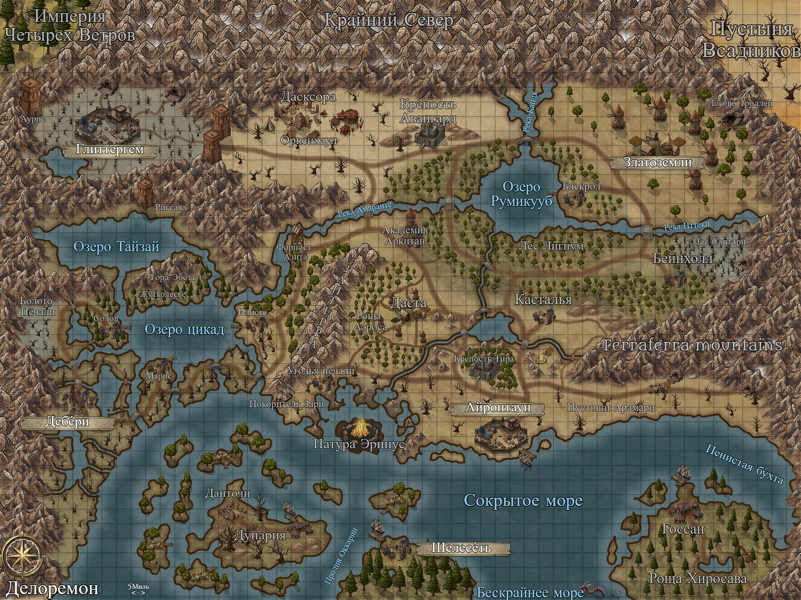

# Аркленс
### Это название моей днд-подобной системы для НРИ, нацеленной на простоту подсчета и удобство ориентирования. 
В данном репозитории будет хранится актуальная информация и данные по Аркленсу, если возникают спорный вопрос то считаем что здесь содержится самая верная инфа, если лично мной не сказано иное.

Планета Аркленс - недружелюбное место с длинной историей, полной сражений и смертей. Только три сотни лет назад народы долины Делормон нашли в себе
силы сформировать союз и жить в мире друг с другом. Во главе угла стояла династия справедливых монархов, Дом Аудитива. Однако короли не правят вечно.
Сейчас род Аудитива прервался. В воздухе висит вопрос о новом правителе, а влиятельные семьи всех провинций готовятся достать кинжалы интриг.
И внутренние враги далеко не единственная угроза людям Аркленса.

Важная заметка

Для часто используемых понятий я использую эмоджи, так как это уменьшает объемы текста и делает его нагляднее. Для таких сокращений есть специальный файл ↓

[Тезаурус](https://github.com/MindHardt/Arklens-guides/blob/main/Тезаурус.md)  

