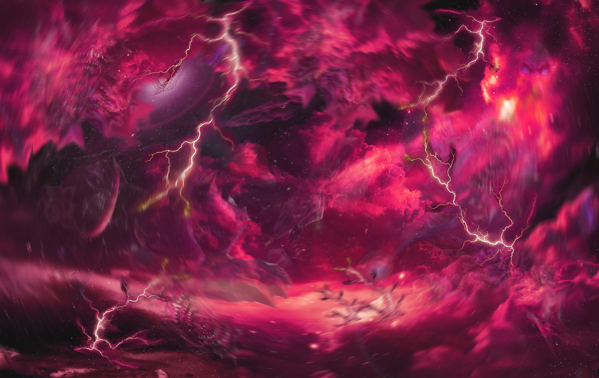

# Эра первичного хаоса
До начала времен, так давно, что это даже нельзя осознать, во вселенной царствовал вечный хаос. 

Неконтролируемая и неописуемая вселенная бесконечной энергии. 
Сколько реальность была в таком состоянии сказать невозможно впринципе, ибо время как структура и понятие тогда не могло существовать.
Однако одно известно точно - из хаоса может зародиться порядок, и хотя чаще всего этот порядок сразу же исчезает в потоке нового хаоса, иногда случается и иначе.  
В первичном хаосе зародился разум. Разум, стремящийся к упорядочиванию, к структуре. Этот разум, по своей сути первый бог, позже получил имя.

### Со'Гло'Гво

Этот разум одним своим существованием упорядочивал материю и энергию вокруг себя. Рядом с ним пространство становилось куда менее кипящим и бурным,
материя получала возможность иметь форму. И хотя хаос постепенно разрушал разум, стачивая его как вода камень, порядок имеет важное свойство.
Порядок порождает порядок. Соперничество этих противоположностей длилась бесконечно долго, ведь вселенная бесконечна сама по себе, 
однако порядок постепенно разрастался, оставляя меньше места для хаоса. В определенный момент в стабильных регионах появился порядок более высокого уровня.

### Дикие боги

Дикие боги это, вкратце, и не боги вовсе, это чистый разум без эго, олицетворение каких-то явлений, собирательное понятие для глобальных духовных структур.
Например, самые известные дикие боги - Магия, Стихии, и самые первые - Реальности. Реальности разделили бесконечный космос на обособленные регионы со своими свойствами. В том числе самого важного для нас - плана материи. 

