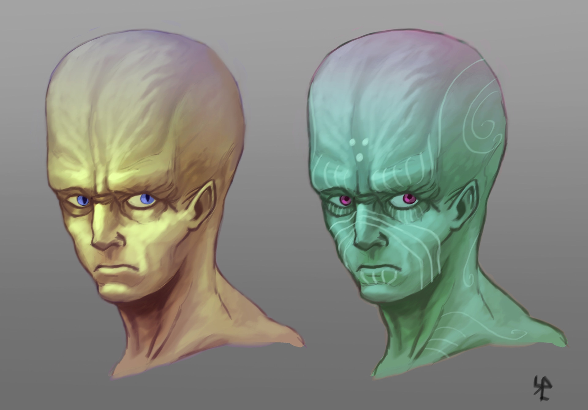

# Эра вторичного хаоса
После появления реальностей, история бесконечного космоса разделилась. Ключевая для смертных, реальность материи, вошла в следующую эпоху -
Эру Вторичного Хаоса.

Последующие дикие боги внесли некий порядок в реальность. Время определило причинно-следственные связи и позволило отделить события друг от друга.
Стихии дали начало разным типам материи и энергии. После этого Души позволили появиться жизни, малым слабым духовным структурам, которые удерживаются от
распада за счет конкретной структуры из вещества, с уникальной возможностью воспроизведения. Однако оставалась проблема:
существа развивались, становились сложнее, их души также усложнялись и становились мощными источниками энергии. Тогда появилась Смерть, ограничивающая
предел мощи одной души. Со смертью существа его сила уходила в окружающее пространство в виде хаотической энергии.
Это не было проблемой пока потом один из видов существ развился настолько, что стал разумным.

### Серый Народ
Был первой расой, получившей самосознание. Это вылилось в проблему: несмотря на то что их жизнь была долгой, очень долгой, они все же умирали. 
И каждая смерть была трагедией и серьезной угрозой, ведь вела к рассеиванию их духовной энергии. Ранняя история Серого Народа полна историй о таких
катаклизмах, называемых "Исход". Тогда миллионы и миллиарды Серых Людей взмолились к высшим силам прося решения этой проблемы, но Дикие Боги не могли
им помочь. И только когда Серый Народ был близок к вымиранию, появился свет надежды.

### Сила Созидания
Общие молитвы, души кричащие в унисон это невероятный источник энергии. Единая мысль "Позвольте нам умирать" вылилась в то, что Серый Народ создал Бога.
Но этот бог, а точнее боги, не были похожи на Диких, у них было лицо, они могли мыслить. Это были первые Рукотворные Боги, разум с Эго.

### Кальциес и Цинцедон
Боги круга душ. Его смысл прост: мелкие и безопасные души растворяются и их энергия возвращаются к жизни. За перерождение был ответственен светлый
брат - Кальциес. Если же душа преисполнена зла и могущества то растворяться ей опасно для всех, поэтому ее остается только изолировать. Для такого
существует темный брат - Цинцедон, и его собственное измерение: Небытие, в котором души находятся все сразу и одновременно, ведь Время там не существует.
Души небытия медленно растворяются в единое целое, из которого уже можно получить безопасную энергию. Теперь каждую более-менее могущественную душу
после смерти ждал суд, оценка двумя братьями, решающими куда далее направится смертный.
