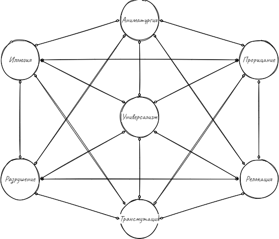

# Волшебник
## Волшебники подходят к магии практически, используя заклинания с помощью своего разума и памяти.
У магии как явления существует много проявлений, волшебники - своего рода ученые, постигающие ее. Для них магия это одна большая непостижимая загадка,
к которой они пытаются найти подходы и решения. Заклинания же - формулы для контроля реальности, которые можно запомнить и использовать. Разумеется,
это описание упрощено и не передает всей сути, но в общем волшебники делают именно это - тратят часы на запоминание и понимание заклинаний.

## Школы волшебников
Волшебники, начиная свой путь в мистицизме, выбирают свою школу заклинаний, то есть тот тип магии, который изучают углубленно. Выбирая любую школу,
кроме Универсализма, волшебник начинает изучать заклинания этой школы ускоренно, но ему сложнее даются заклинания противоположной школы.

