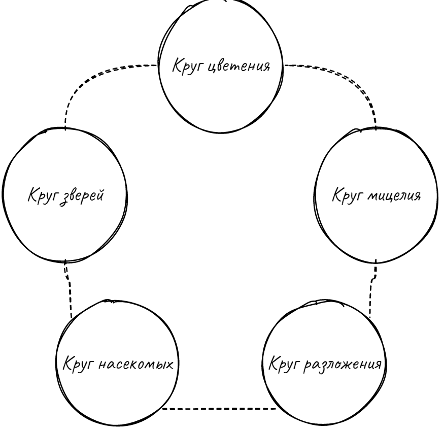

# Друид
## Друиды это хранители природы, проводники ее воли и носители ее силы. 
Природа, являясь мощной сущностью и огромным источником духа, тем не менее не может считаться богом,
так как она не централизована, разнородна и неразумна. Друиды же способны улавливать волю живых существ вокруг себя, 
они с природой находятся в состоянии симбиоза.  

## Круги друидов  
Друиды отличаются друг от друга аспектом природы, с которым они связаны. От этого аспекта, "круга" друида, зависят его возможности и силы.
Различают пять кругов друидов, вместе они составляют пятиугольник, называемый "Кругом Адеррана", по имени древнего исследователя.

Каждый круг связан с двумя соседними, это значит что друид любого круга имеет способности схожих кругов, но не в той же мере, что свои собственные.

 
  
Круг цветения

  
Флорилиты имеют сильную связь с растениями, они способны призывать лозы, корни, плоды и прочие проявления флоры. Эти друиды - лучшие природные целители.

  

 
  
Круг мицелия

  
Мицеилиты связаны с грибами разных сортов. Им комфортнее в темноте и сырости, они способны призывать как болезнетворные споры так и полезные грибки.

 
  
Круг разложения

  
Декалиты представляют разложение и обновление природы. Они считают смерть не только неизбежным концом, но и новым началом. Им подвластны самые смертоносные болезни.

  

 
  
Круг насекомых

  
Этномолиты постоянно окружены роем различных насекомых. В их распоряжении есть как ядовитые скорпионы и пауки, так и полезные жуки-олени и прочая мелкая живность.

 
  
Круг зверей

  
Зоолиты без сопровождения четвероногими друзьями - редкое зрелище. Они могут как договариваться с дикими животными, так и устанавливать особую связь со своими компаньонами.

## Общие черты
### Мировоззрение
| - | З | Н | Х |
|:-:|:-:|:-:|:-:|
| Д |❌ |✅ |❌ | 
| Н |✅ |✅ |✅ |
| З |❌ |✅ |❌ |  

Из-за разобщенной и умеренной сути природи, друиды не могут принадлежать к радикальным мировоззрениям. Им доступно любое нейтральное мировоззрение.

### Владение оружием и доспехами
Вследствие своей связи с природой, друидам противна мысль использовать металлическое оружие и доспехи, они предпочитают держать в руках дерево и носить на себе кожу. (список будет позже)

### 
